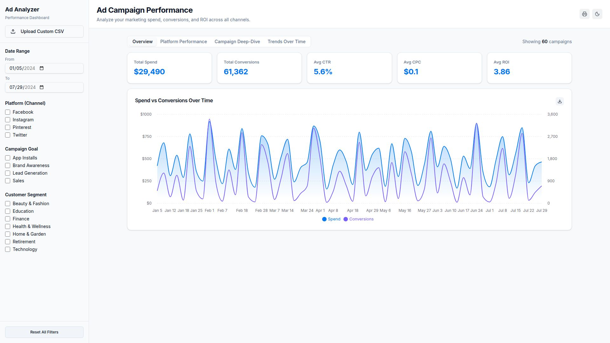

# Ad Campaign Performance Analyzer

A Streamlit dashboard for analyzing social media ad campaign performance across spend, clicks, impressions, conversions, ROI, platform, customer segment, and campaign goal.

The app ships with a sample campaign dataset and also supports uploading a custom CSV from the sidebar.



## Features

- Default sample data loaded from `artifacts/ad-campaign-analyzer/public/social_media_advertising_sample.csv`.
- Custom CSV upload from the Streamlit sidebar.
- Date, platform, campaign goal, and customer segment filters.
- KPI cards for total spend, conversions, CTR, CPC, and ROI.
- Four dashboard tabs:
  - `Overview`: spend and conversions over time.
  - `Platform Performance`: channel-level spend, conversions, CTR, CPC, and ROI.
  - `Campaign Deep-Dive`: searchable campaign table and funnel view.
  - `Trends Over Time`: selectable trend chart for spend, clicks, conversions, or ROI.
- Data cleaning for currency-formatted acquisition cost, duration text, dates, and numeric metrics.

## Tech Stack

- Python 3.13+
- Streamlit
- pandas
- Plotly
- uv for Python dependency management
- pnpm workspace artifacts for the accompanying TypeScript/Replit app structure

## Run Locally

Install Python dependencies with `uv`:

```bash
uv sync
```

Start the Streamlit app:

```bash
uv run streamlit run streamlit_app/app.py
```

Then open the local URL printed by Streamlit, usually `http://localhost:8501`.

## Replit Run Command

The included Replit runner uses:

```bash
bash streamlit_app/run.sh
```

That script expects Replit-style environment variables such as `PORT`.

## CSV Schema

Custom uploads should include the same columns as the sample dataset:

```csv
Campaign_ID,Target_Audience,Campaign_Goal,Duration,Channel_Used,Conversion_Rate,Acquisition_Cost,ROI,Location,Language,Clicks,Impressions,Engagement_Score,Customer_Segment,Date,Company
C001,18-25,Brand Awareness,15 Days,Facebook,0.12,"$420.00",3.2,New York,English,4200,85000,72,Health & Wellness,2024-01-05,AlphaMedia
```

Important fields used by the dashboard:

- `Acquisition_Cost`: cleaned into numeric `Spend`.
- `Duration`: cleaned into numeric `Duration_Days`.
- `Date`: parsed into a date for filtering and trend charts.
- `Clicks`, `Impressions`, `Conversion_Rate`, `ROI`, `Engagement_Score`: converted to numeric values.
- `Conversions`: derived as `Clicks * Conversion_Rate`.

Rows missing critical metric fields are dropped during cleaning.

## Repository Structure

```text
.
|-- streamlit_app/
|   |-- app.py
|   `-- run.sh
|-- artifacts/
|   |-- ad-campaign-analyzer/
|   |-- api-server/
|   `-- mockup-sandbox/
|-- attached_assets/
|-- lib/
|   |-- api-client-react/
|   |-- api-spec/
|   |-- api-zod/
|   `-- db/
|-- scripts/
|-- pyproject.toml
|-- uv.lock
|-- package.json
|-- pnpm-lock.yaml
|-- pnpm-workspace.yaml
`-- replit.md
```

## TypeScript Workspace

The repo also contains a pnpm workspace with generated/client/server artifacts. Useful commands:

```bash
pnpm run typecheck
pnpm run build
pnpm --filter @workspace/ad-campaign-analyzer run dev
```

The Streamlit app is the primary runnable dashboard in this repository.

## Notes

- No API keys or external services are required for the Streamlit dashboard.
- Keep `.local/`, `.venv/`, `node_modules/`, build outputs, and TypeScript build info files out of git.
- If you change the sample dataset path, update `DEFAULT_CSV_PATH` in `streamlit_app/app.py`.
